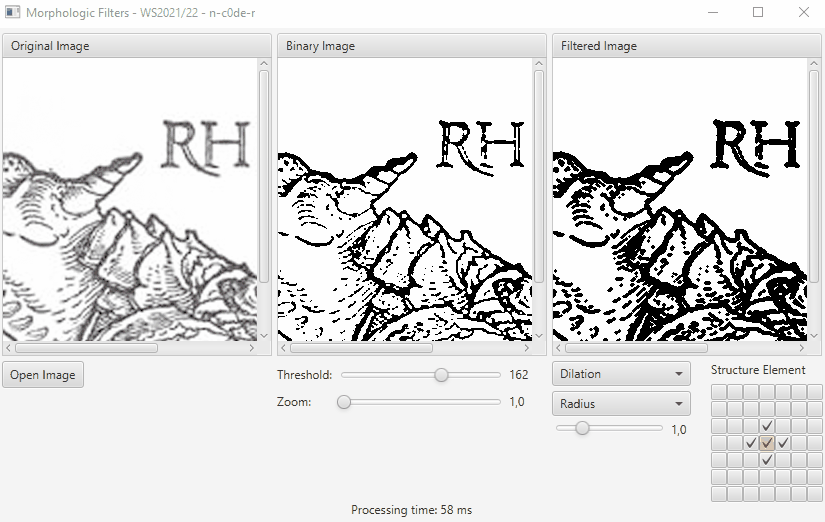

# IP-Exercises
Various exercises from image processing class.
This time I can't upload anything in here, because the professor
specifically asked us not to (if it can be avoided)! He's struggling
every semester to come up with new tasks, since everyone is sharing
their solutions on GitHub - robbing coming semesters from the chance
of learning for themselves...
(Though he understands the importance for students to showcase
every bit of knowledge to get chances on jobs.)

## Exercise 1 - Gaussian Filter
This one was about calculating Gaussian Filters, applying them
correctly, and learning how JavaFX works (manipulating the GUI via it).

## Exercise 2 - Perspective
The goal here was to apply a perspective rotation and distortion
to an image, calculate pixel colors correctly with nearest neighbor &
bilinear filtering. There was also a speed-contest for the most
efficient code. (I shared the 2nd place with one anonymous other
student - the professor scored nr 1 of course.)

## Exercise 3 - Morphologic Filter
In this one we were about to learn binarizing a picture to apply
morphologic filters such as dilation, errosion, opening & closing
via a variable structure element.

## Exercise 4/5 - Histogram
This was a continous task. First we had to create and display a 
histogram correctly. To do that, one needs to understand the math.
Next we had to get various statistic numbers from the histogram.
Lastly, we should to apply an overlay image where the entropy or
variance exceeded a movable threshold.

